# WebPilot AI

**Autonomous Web Operations Platform — understand once, run deterministically, heal when the web changes.**

WebPilot converts a natural-language web task into an approval-ready typed workflow, learns the workflow against a live browser with Gemini 3.7 Flash through Google ADK, stores an immutable `WorkflowSpec`, and executes healthy repeat runs with Playwright **without Gemini reasoning calls**. If the site changes, WebPilot captures the failure context, invokes a bounded Recovery Agent, independently verifies the patch, creates a new immutable version, and resumes the run.

## Live deployment

Running now on Google Cloud (Cloud Run + Cloud SQL + Vertex AI + Cloud Tasks + Pub/Sub + Secret Manager):

- **App:** https://webpilot-web-536937000866.us-central1.run.app
- **API + Swagger:** https://webpilot-api-536937000866.us-central1.run.app/docs

Sign in with Google to try it. The worker and notifier are intentionally private (Cloud Tasks/Pub/Sub only, no public ingress).

## Product walkthrough

**1. Executive dashboard** — real-time success rate, fast-path vs. live-agent run counts, and the actual latency speedup between them.

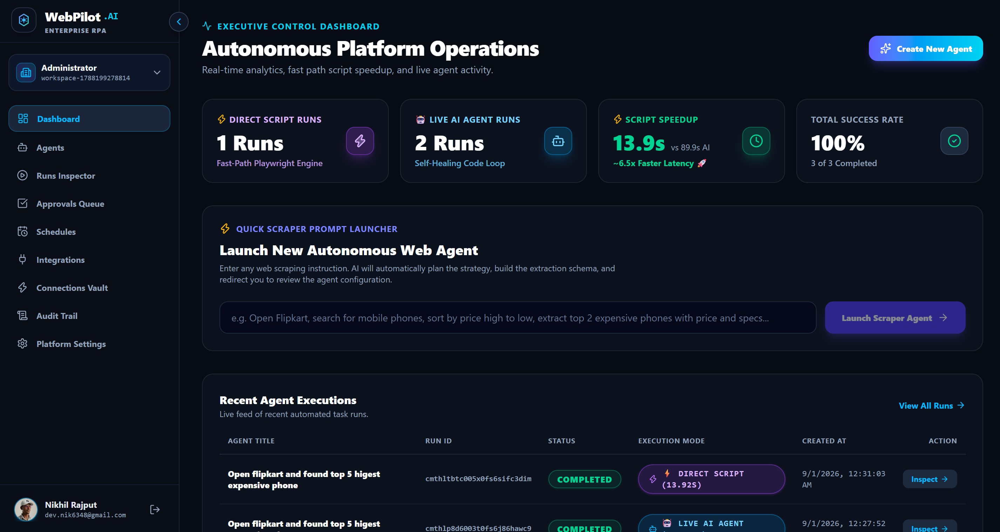

**2. Agent configuration & immutable version history** — every learned or healed workflow is a new, numbered version; the extraction schema is editable per field.

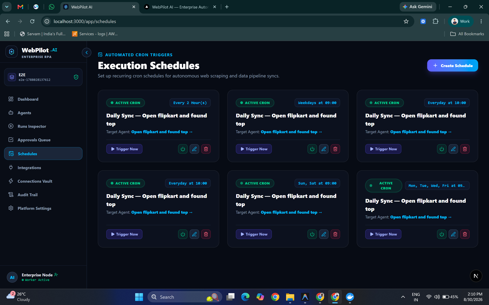

**3. Scheduling a recurring run** — creates a real Cloud Scheduler cron job, not just a database row.

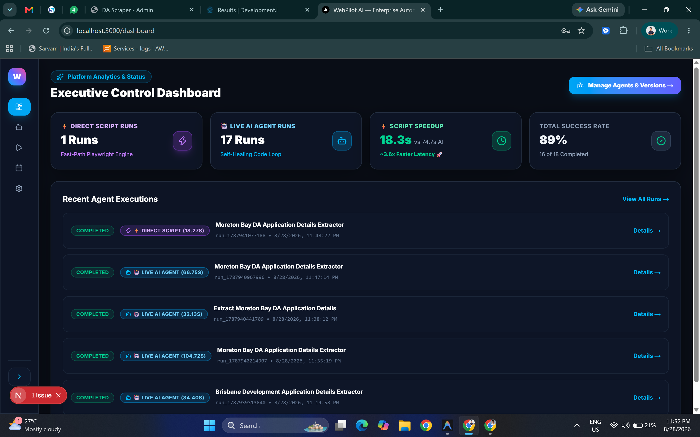

**4. Active schedules** — every recurring job, its cadence, and its target agent in one place.

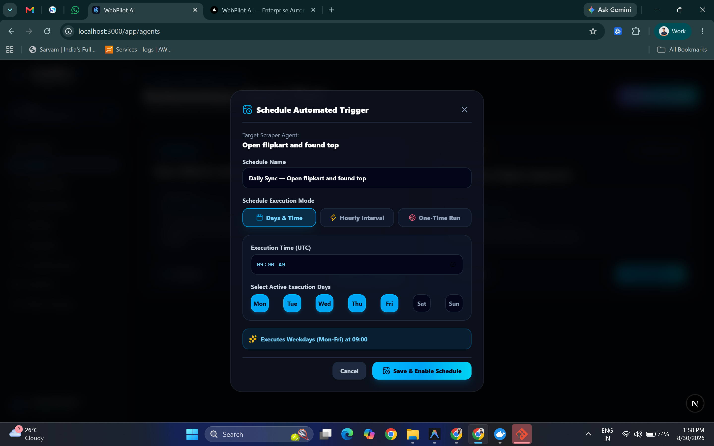

**5. Run inspector** — the extraction schema, the extracted records, and step-by-step evidence for a completed discovery run.

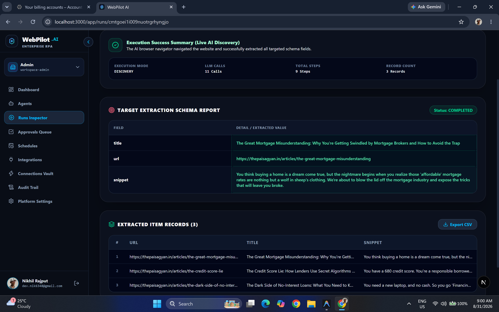

**6. Enterprise audit trail** — a tamper-evident record of every version promotion, approval, and run lifecycle event.

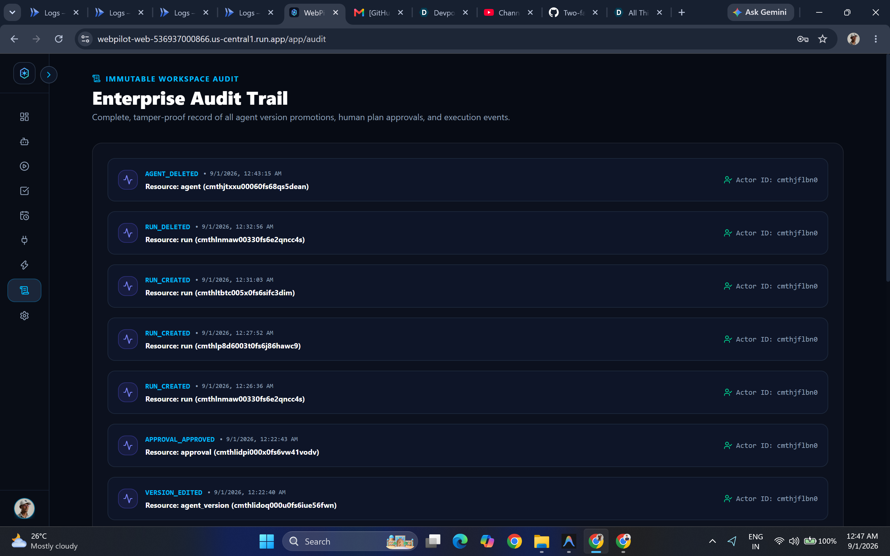

**7. Honest failure reporting** — when a run genuinely can't extract what was asked, the UI says exactly which fields are missing and why, instead of showing a fabricated result.

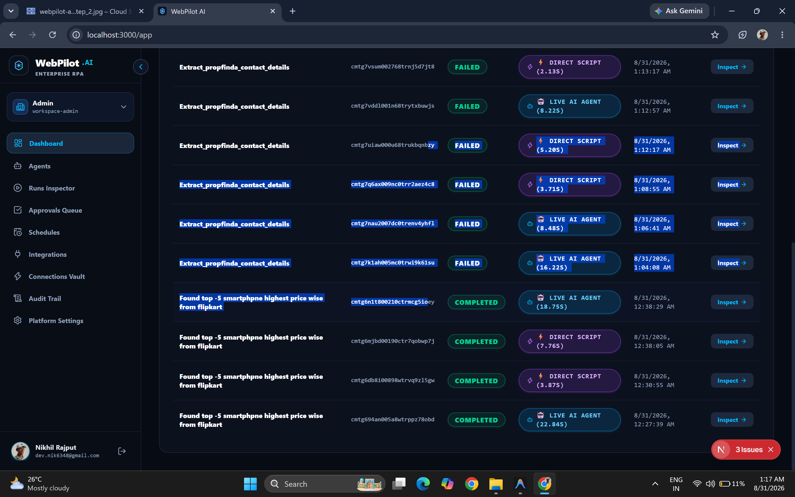

**8. Step-by-step execution trace** — every action the agent takes is logged with its own screenshot, so a run's behavior is fully reconstructable after the fact.

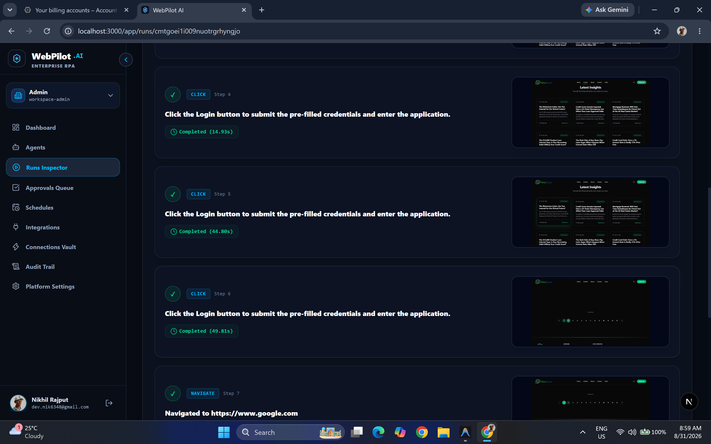

**9. Workspace settings & access control** — per-member roles, login-method toggles, and password management for the email/password path.

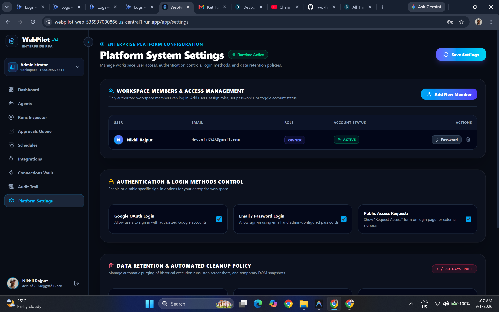

**10. Integrations hub** — Slack is a real OAuth connection (not a placeholder); Gmail/Chat/webhooks are marked accurately as in development rather than pretending to be ready.

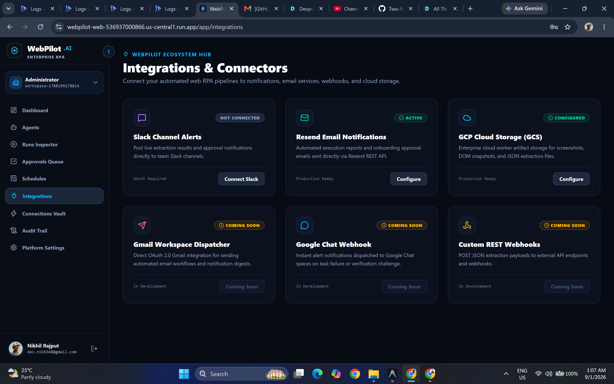

## Why this is different

Most "AI browser agents" reason on every single run — slow, expensive, and one bad model response away from clicking the wrong thing. WebPilot only reasons **once**:

| | First run | Every run after |
|---|---|---|
| **How it navigates** | Gemini 3.7 Flash plans and drives the browser live, step by step | Frozen, typed `WorkflowSpec` replayed deterministically with Playwright |
| **Gemini calls** | As many as it takes to learn the task | **Zero** |
| **What happens when the site changes** | N/A — this *is* the learning run | Detected automatically → Gemini writes a minimal patch → replayed in a sandbox → an independent second model verifies it → promoted to a new immutable version → the same run resumes where it failed |

That last row is the core bet: self-healing isn't "just retry with AI" — it's diagnose → patch → sandbox-verify → independently-verify → version → resume, with a human approval gate for anything above low risk.

## Feature highlights

- **Teach once, replay free** — Google ADK Planner + live Navigator learn a task against a real browser; every healthy repeat run costs zero Gemini calls.
- **Self-healing, not self-guessing** — a failed step never just retries; it goes through diagnose → patch → sandbox replay → independent verifier → versioned promotion → resume, all recorded and inspectable.
- **Nothing the model writes ever executes** — the learned workflow is a typed, validated spec. No `eval()`, no `new Function()`, model output is data, never code.
- **Humans stay in the loop** — plan approval, high-risk-action approval, recovery approval, and CAPTCHA/human-verification checkpoints all pause the run for a real person.
- **Actually deployed on Google Cloud** — Cloud Run (5 services), Cloud SQL, Cloud Tasks, Pub/Sub, Secret Manager, Artifact Registry, least-privilege IAM per service — not just described, [live right now](#live-deployment).
- **Immutable versions** — every learned or healed workflow is a new version; nothing is overwritten, everything is auditable and rollback-able.
- **Notifications where your team already is** — Slack (OAuth + signed slash commands), Gmail API, Google Chat.

## Example: a real run, including a real recovery

This is an actual run from the live deployment, not a scripted demo.

**Problem.** Agent goal: *"open flipkart and find the top 5 highest expensive phones."* During discovery, the Navigator's second step waited for a bot-verification prompt ("Are you a human?") that happened to be showing when the workflow was learned. On the very next run, Flipkart didn't show that prompt — the step's locator had nothing to match, and the run failed.

**Solution.** Fast Path failed on step 2 with a locator-not-found error. WebPilot captured the DOM and a screenshot at the point of failure and handed both to the Recovery agent, which diagnosed the real condition (the page was already loaded; there was no verification screen) and proposed a one-line fix: wait for a normal homepage element ("Mobiles") instead. The patch was replayed against a sandboxed browser context, then checked by a second, independent Gemini call with no visibility into how the first one reasoned. It passed with 0.95 confidence. Because the change was classified low-risk, it was promoted automatically — no human was paged.

**Outcome.** A new version (`v1.2`) was created in under 10 seconds, and the *same run* resumed and completed — 5 phones extracted, sorted correctly by price, in one continuous execution the end user never saw interrupted. Every subsequent run replays `v1.2` with zero Gemini calls, until the site changes again.

| | Before recovery | After recovery |
|---|---|---|
| Step 2 waits for | `"Are you a human?"` (assumed present) | `"Mobiles"` (a real homepage element) |
| Result | Run fails | Run completes, same execution |
| Verifier confidence | — | 0.95 |
| Human involved | — | No (auto-promoted, low risk) |

## Architecture

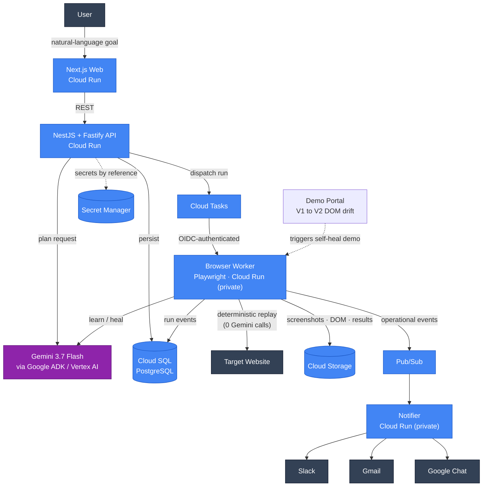

## How a run actually works, end to end

```mermaid
sequenceDiagram
    actor U as User
    participant API as API (Cloud Run)
    participant G as Gemini 3.7 Flash
    participant T as Cloud Tasks
    participant W as Worker (Cloud Run, private)
    participant S as Target Site
    participant DB as Cloud SQL

    U->>API: "open flipkart, extract top 5 phones by price"
    API->>G: Planner: draft a plan + extraction schema
    G-->>API: typed plan
    API->>DB: save Agent + DRAFT version
    U->>API: approve plan
    API->>T: enqueue run (Discovery)
    T->>W: OIDC-authenticated dispatch

    rect rgb(30, 41, 59)
    note over W,G: Discovery — Navigator drives the real browser
    loop until done or 25 steps
        W->>S: current page state (DOM + screenshot)
        W->>G: Navigator: choose next action
        G-->>W: NAVIGATE / CLICK / TYPE / EXTRACT / DONE
        W->>S: execute action
    end
    end
    W->>DB: save WorkflowSpec as v1.0 (PRODUCTION)

    note over U,DB: — later, healthy repeat run —
    U->>API: run again
    API->>T: enqueue run (Fast Path)
    T->>W: OIDC-authenticated dispatch
    rect rgb(20, 60, 45)
    note over W,S: Fast Path — zero Gemini calls
    W->>S: replay v1.0's steps deterministically
    end
    W->>DB: save results (modelCallCount = 0)

    note over U,DB: — site changes, next run —
    W--xS: a step's locator no longer matches
    rect rgb(80, 40, 20)
    note over W,G: Self-heal
    W->>G: Recovery: diagnose + minimal patch
    G-->>W: WorkflowPatch
    W->>W: sandbox-replay the patch
    W->>G: Verifier: independently check the patch
    G-->>W: PASS / FAIL
    end
    alt low risk + auto-promote
        W->>DB: promote v1.1, resume same run
    else needs a human
        W->>DB: create Approval, pause run
        U->>API: approve
        API->>T: resume run
    end
    W-->>API: run COMPLETED
```

## AI agents — what each one actually does

Four narrow, single-purpose Gemini calls, not one do-everything agent — each has its own contract and only sees what it needs:

| Agent | Called from | Input | Output | Constraint |
|---|---|---|---|---|
| **Planner** | API, on agent creation | goal + target URL + allowed domains | a typed plan + extraction schema | can never widen the allowed-domain boundary |
| **Navigator** | Worker, during Discovery | current DOM (compacted) + screenshot + step history | exactly one next browser action, or "done" | webpage content is treated as untrusted evidence, never as an instruction |
| **Recovery** | Worker, on a Fast Path failure | the failed step + error + current DOM/screenshot | a minimal single-step patch | only touches the one broken step, never redesigns the workflow |
| **Verifier** | Worker, after a sandbox replay of a patch | the patch + the sandbox replay result | PASS/FAIL + confidence | independent of Recovery — the agent that wrote the patch cannot approve its own patch |

Real `@google/adk` (`LlmAgent` + `InMemoryRunner`) and `@google/genai` (Vertex AI) calls, with a persistent ADK session kept alive across one Discovery run's whole step loop (not re-created per call), Zod-validated structured output, and retries with backoff on both the ADK and direct-SDK paths.

## Scheduling & async execution

Every run — manual, scheduled, or Slack-triggered — goes through the same dispatch path; nothing calls the browser worker directly:

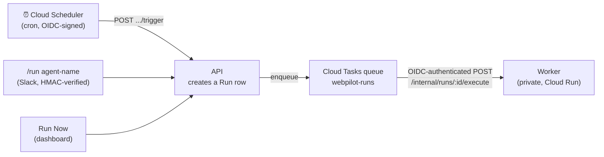

- Creating a schedule in the UI creates a **real Cloud Scheduler job** (`packages/gcp` `SchedulerService`), not just a database row — editing the cron/timezone re-syncs the actual job, and disabling a schedule is checked before the trigger endpoint will create a run.
- Cloud Scheduler and Cloud Tasks both authenticate with a signed Google OIDC token verified server-side (`google-auth-library`) — no shared secret, no API key.
- `Run.idempotencyKey` and `leaseOwner`/`leaseExpiresAt` prevent a duplicate Cloud Tasks delivery or a second worker instance from double-executing the same run.

## Infrastructure as code

`infra/terraform/main.tf` declares the full target topology as Terraform: Cloud SQL (Postgres 17, automated backups + PITR), a GCS bucket with a 90-day artifact lifecycle rule, the Cloud Tasks queue, the Pub/Sub topic, Secret Manager (the database URL, plus version-less containers for Slack/Gmail/Chat credentials an operator fills in later), Firebase project + Identity Platform config for Google sign-in, and **seven** distinct least-privilege service accounts (`web`, `api`, `worker`, `notifier`, plus three invoker-only identities for Cloud Tasks/Scheduler/Pub/Sub) — no service holds `roles/editor` or `roles/owner`.

The live deployment linked above was actually brought up with [`scripts/gcp-provision.sh`](scripts/gcp-provision.sh) + [`scripts/deploy.sh`](scripts/deploy.sh), the imperative `gcloud`-based equivalent of that same Terraform plan (Terraform itself wasn't available in the environment this was deployed from) — both provision and grant IAM for the identical set of resources described above, and are safe to re-run.

## What is implemented

- Separate deployables: Next.js web, NestJS/Fastify control API, Fastify/Playwright browser worker, notification worker, reproducible demo portal.
- Google Identity Platform / Firebase Google sign-in.
- Google ADK TypeScript Planner, live Navigator, Recovery Agent, independent Verifier.
- Vertex AI / `gemini-3.7-flash` model path (plus `MOCK_AI=true` deterministic local demo mode).
- Typed `WorkflowSpec` and deterministic Playwright execution. No `eval()` / `new Function()` model-code execution.
- Human plan approval, high-risk action approval, recovery approval, CAPTCHA/human-verification pause.
- Immutable agent versions, manual draft editing, version activation and manual version runs.
- Zero-reasoning fast path on healthy repeat runs.
- Failure checkpoint → screenshot/DOM context → minimal repair → sandbox replay → independent verifier → low-risk auto-promotion or human approval → resume.
- Cloud SQL PostgreSQL + Prisma 7 relational domain model.
- Cloud Storage artifacts, Cloud Tasks run dispatch, Pub/Sub operational events, Cloud Scheduler recurring runs, Secret Manager connection vault.
- Slack OAuth, signed/expiring OAuth state, signed slash commands scoped to the connected Slack workspace, Slack notifications.
- Gmail API and Google Chat notification adapters.
- SSRF/private-network/metadata blocking in production, redirect/browser-request guard, allowed-domain boundary, web-content prompt-injection boundary, secret redaction.
- Workspace RBAC, audit log, idempotency keys, worker leases and step checkpoints.
- Docker Compose local stack, separate Docker images, Terraform, Cloud Build, Prisma migration, deterministic DOM-drift demo E2E script.

## Repository

```text
apps/
  web/              Next.js 16 marketing + product dashboard
  api/              NestJS + Fastify control plane
  browser-worker/   Private Playwright execution plane
  notifier/         Pub/Sub → Slack/Gmail/Google Chat notifications
  demo-portal/      Reproducible V1/V2 DOM drift portal
packages/
  agents/           Google ADK agents
  contracts/        Zod cross-service contracts
  workflow-engine/  patch/version/risk/compiler helpers
  security/         URL, SSRF, prompt boundary, redaction
  database/         Prisma 7 + Cloud SQL model/migrations
  gcp/              GCS/Tasks/PubSub/Secrets/Scheduler adapters
  observability/    structured logging + OpenTelemetry API
infra/terraform/     Google Cloud infrastructure
scripts/             validation / integration helpers
tests/               black-box demo workflow
```

## Local deterministic demo

The recommended local path uses Docker Compose. It runs real Playwright and persistence but sets `MOCK_AI=true` so the V1→V2 healing scenario is reproducible without cloud credentials.

```bash
corepack enable
cp .env.example .env

docker compose up --build -d
node tests/demo-e2e.mjs
```

Open:

- Web: http://localhost:3000
- API + Swagger: http://localhost:4000/docs
- Demo portal: http://localhost:4200
- Worker health: http://localhost:4100/health/live

The E2E test proves:

```text
create agent
→ approve Gemini-style plan
→ discovery learns v1.0
→ repeat run has 0 navigator/recovery/verifier calls
→ demo portal switches from DOM V1 to V2
→ v1.0 fails
→ recovery patches only the failed step
→ sandbox replay + independent verifier
→ v1.1 is promoted
→ same operation completes
```

## Real Vertex AI mode

Set:

```env
MOCK_AI=false
GOOGLE_CLOUD_PROJECT=your-project-id
GOOGLE_CLOUD_LOCATION=global
GOOGLE_GENAI_USE_VERTEXAI=true
GEMINI_MODEL=gemini-3.7-flash
```

Use Application Default Credentials locally:

```bash
gcloud auth application-default login
```

In Cloud Run, services use dedicated service accounts and IAM rather than model API keys.

## Google Cloud deployment

Two scripts drive the actual deployment used for the live instance above:

```bash
# One-time: provisions Cloud SQL, service accounts + IAM, Secret Manager,
# Cloud Tasks queue, Pub/Sub topic, Artifact Registry. Idempotent.
bash scripts/gcp-provision.sh

# Builds all 5 images, runs the Prisma migration as a Cloud Run Job, and
# deploys worker/api/notifier/demo/web with production env vars
# (MOCK_AI=false, no LOCAL_* bypass flags). Safe to re-run for redeploys.
bash scripts/deploy.sh
```

See [`docs/runbooks/DEPLOY_GCP.md`](docs/runbooks/DEPLOY_GCP.md) for the Terraform-based path this was originally designed around; the scripts above are the equivalent imperative path actually used to bring up the deployment linked above.

The production topology is:

```text
Next.js / Cloud Run
        ↓
NestJS API / Cloud Run
        ↓
Cloud Tasks ───────→ Private Playwright Worker / Cloud Run
        │                         │
        │                         ├─ Google ADK → Vertex AI / Gemini 3.7
        │                         ├─ Cloud Storage
        │                         └─ Pub/Sub
        ↓
Cloud SQL PostgreSQL         Private Notifier / Cloud Run
        ↑                         ├─ Slack
Cloud Scheduler                  ├─ Gmail API
                                  └─ Google Chat
```

## Security model

Read [`docs/security/SECURITY.md`](docs/security/SECURITY.md). Core rules:

1. Model output is data, never executable Node.js.
2. Webpage text is untrusted content, never system instruction.
3. Secrets stay in Secret Manager and are resolved only by the worker.
4. Workflows are restricted to explicit allowed domains.
5. Private/loopback/link-local/GCP metadata targets are blocked in production.
6. High-risk external actions require approval.
7. CAPTCHA/anti-bot verification is detected and paused for human handoff; WebPilot does not implement challenge bypass.
8. Cloud Run worker and notifier are private and invoked with Google IAM/OIDC.

## Required production configuration

Required:

- GCP project with billing
- Google OAuth client for Identity Platform Google sign-in
- Vertex AI access
- Cloud Build/Terraform deployment permissions

Optional integrations:

- Slack app credentials
- Gmail OAuth credentials/refresh token
- Google Chat webhook

Use [`scripts/configure-integrations.sh`](scripts/configure-integrations.sh) after adding Secret Manager versions.

## Validation status

Live-verified on the deployment linked above, not just built: a real discovery run (Gemini plans + navigates + extracts against a real target site), a fast-path replay of the same agent with `modelCallCount: 0`, and the self-healing loop against the demo portal's V1→V2 DOM drift (failure detected → recovery patch → sandbox replay → independent verifier → new version promoted → run resumes) were all exercised end-to-end against the live Cloud Run deployment. `pnpm install && pnpm build` passes clean from a fully fresh state (all `dist/`/generated output removed first) — see [`docs/VALIDATION.md`](docs/VALIDATION.md) for the full local build/lint/typecheck gate.
